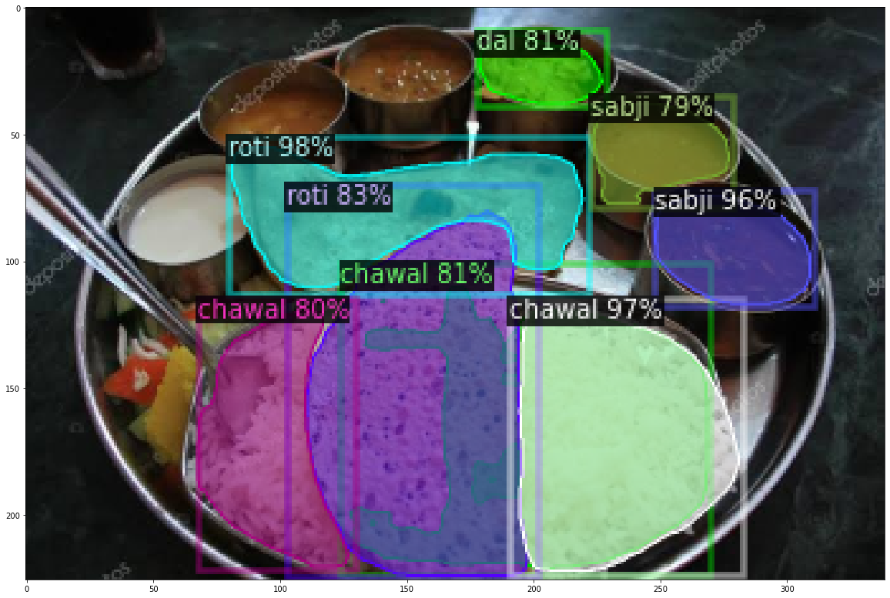
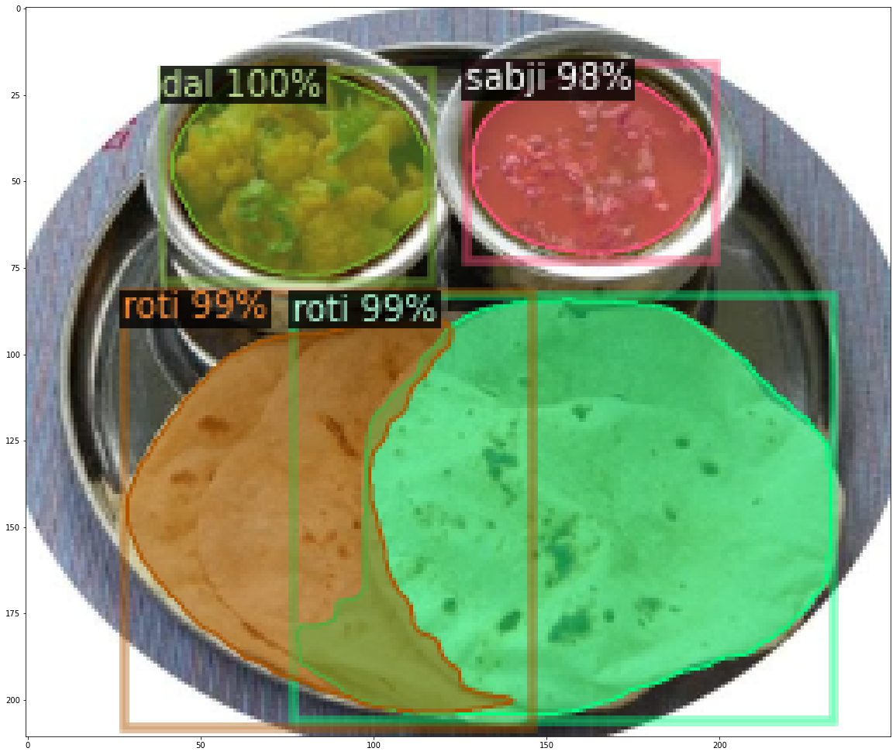

# Indian food detection

This repo contains the code to train and test the custom dataset. The emphasis is more on loading custom images and annotation.

#Instructions to run this code
1. Install detectron 2 as given [here](https://github.com/facebookresearch/detectron2/blob/master/INSTALL.md)
2. Extract the dataset indianfood.zip 
3. Run the code cells

